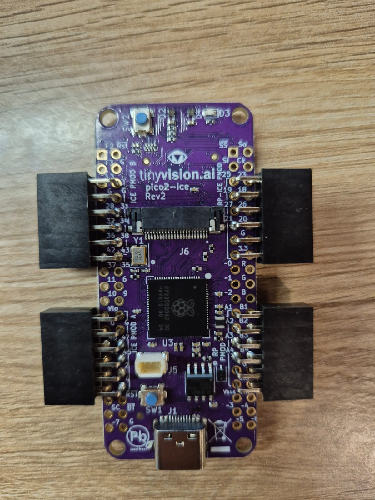

# Newton: A Self Learning Closed-Loop Flow Policy on open source Lattice FPGA flows (iCE40UP5K)

---

## About Newton

Newton is a self-learning, memory-bearing agent for physical design. As it works alongside engineers on RTL-to-GDSII flows, it absorbs the recipes, heuristics, and hard-won judgment of an organization's most experienced PD engineers — and makes that captured expertise available to every other engineer using the system. Newton deploys inside the customer's environment, so the knowledge stays in-house, and the agent grows with the organization over time: as Lattice's flows and customer designs evolve, so does Newton's understanding of what works.

The work in this note applies Newton's underlying closed-loop reasoning to the open-source iCE40 flow — Yosys, nextpnr, and icepack — as a generalization test on Lattice silicon. Every decision in this study is written into a human-readable markdown reasoning trace: what Newton tried, what it observed, and why it picked the candidate it did.

---

## Target device and tool flow

The target for this experiment is the Lattice iCE40 UltraPlus family:

| Item | Value |
|---|---|
| Board target | pico2-ice |
| FPGA | Lattice iCE40UP5K |
| Package | SG48 |
| Logic-cell budget used by reports | 5280 LC |
| BRAM budget used by reports | 30 RAM blocks |
| DSP budget used by reports | 8 DSP blocks |
| Open-source flow | Yosys → nextpnr-ice40 → icepack |

The vanilla compile recipe is effectively:

```bash
yosys -p 'synth_ice40 -top top -json top.json' top.v
nextpnr-ice40 --up5k --package sg48 \
  --json top.json \
  --pcf pico2_ice.pcf \
  --asc top.asc \
  --freq <target_mhz> \
  --pcf-allow-unconstrained
icepack top.asc gateware.bin
```

The point of using iCE40UP5K is not that Newton is an iCE40 product. Newton's primary product surface is ASIC physical design. The iCE40 work is a controlled FPGA generalization test: can the same closed-loop policy idea sit above a very different toolchain, keep RTL fixed, and still make useful implementation decisions?

### Hardware and demo assets

The experiments target a pico2-ice board carrying the iCE40UP5K-class FPGA used by the open-source Lattice flow.



The CNN section below also has a short hardware-demo clip showing the sample CNN classifier running on the FPGA model/board setup. GitHub renders the linked asset as a downloadable/playable video depending on browser support.

<video src="images/cnn_classifier_fpga_demo.mp4" controls width="720"></video>

If the embedded video does not render, open it directly: [CNN classifier FPGA demo video](images/cnn_classifier_fpga_demo.mp4).

---

## Goal and methodology

**What we tested.** Whether a closed-loop diagnose-propose-evaluate layer above synthesis and place-and-route can improve implementation outcomes on fixed RTL.

**What was held fixed.** RTL, trained weights where applicable, PCF/IO constraints, FPGA target, package, and functional behavior. No RTL edits. No constraint edits.

**What was varied.** Legal implementation-flow policy only:

- Yosys synthesis options: `-dff`, `-nodffe`, `-dffe_min_ce_use`, `-dsp`, `-device u`, and custom ABC script variants.
- nextpnr seeds.
- nextpnr implementation target / overconstraint settings.
- Objective-specific scoring functions: `max_fmax`, `min_lc_pass_timing`, `min_runtime_pass_timing`, and `balanced`.
- Timing, bitstream, and warning acceptance gates.

**How Newton evaluates.** Newton runs a vanilla baseline, parses QoR and logs, classifies the pressure point, proposes one or more legal same-RTL flow candidates, runs them, and then decides whether to continue, escalate, or stop. The output is not just a bitstream; it is a reasoning trace that records the observed result, hypothesis, command, and selection rationale.

**Variance note.** The CNN result below now includes a full 1150-attempt sweep across synthesis strategies, implementation targets, and seeds. For PWM, the headline result comes from the adaptive trace: baseline plus a targeted `-dff` candidate with seeds 1–3, where seed 1 produced the selected result. The key claim is therefore not that every seed improves, but that Newton can discover and record a better legal implementation policy under the stated objective.

---

## RTL 1: `06_rgb_pwm_fixed` — control/datapath, timing-margin objective

### Design architecture

`06_rgb_pwm_fixed` is a small RGB PWM control/datapath block. It is dominated by counters, compare logic, simple state/control behavior, and output-register logic rather than memories or multipliers. This is the kind of modest control design that often already closes timing, but where a different register/control mapping can still change placement, routing, and critical-path delay.

### Small block diagram

```text
        clk / reset
            │
            ▼
   ┌─────────────────┐
   │ Timing / period │
   │ counter logic   │
   └────────┬────────┘
            │ phase count
            ▼
   ┌─────────────────┐       duty / threshold constants
   │ RGB compare +   │◄───────────────────────────────┐
   │ PWM decision    │                                │
   └────────┬────────┘                                │
            │ pwm_r/g/b                               │
            ▼                                         │
   ┌─────────────────┐                                │
   │ Output register │                                │
   │ / LED drivers   │                                │
   └────────┬────────┘                                │
            │                                         │
            ▼                                         │
       RGB LED pins                                  fixed RTL
```

The Newton-relevant implementation choice is mostly around register/control mapping and physical placement of the counter/compare/output-register path; there is no BRAM or DSP resource decision in this design.

### Vanilla flow results

| Metric | Value |
|---|---:|
| LC | 156 / 5280 |
| BRAM | 0 / 30 |
| DSP | 0 / 8 |
| Fmax | 65.91 MHz |
| Target | 48 MHz |
| Margin | +17.91 MHz |
| Timing | pass |

Vanilla recipe:

```text
synth_ice40 default → nextpnr-ice40 --up5k --freq 48 → icepack
```

### Newton strategies tried

Newton's reasoning trace for PWM was:

| Step | Strategy | Command / policy | Observation | Decision |
|---:|---|---|---|---|
| 0 | Vanilla baseline | `synth_ice40 -top top -json top.json`; nextpnr target 48 MHz | Accepted bitstream, timing clean, LC 156, Fmax 65.91 MHz, margin +17.91 MHz | Timing passes; resource/runtime tradeoff and extra timing headroom are useful pressures. Try a semantics-preserving Yosys option. |
| 1 | DFF/register-mapping candidate | `synth_ice40 -dff -top top -json top.json`; nextpnr target 48 MHz; seeds 1, 2, 3 | Best candidate accepted, LC 158, Fmax 72.66 MHz, margin +24.66 MHz, seed 1 | Stop. `adaptive_001_yosys_dff` is the best observed legal same-RTL policy for the balanced objective. |

Relevant trace lines from the run:

```text
inspect logs/QoR: Fmax 65.91 MHz is above target 48.00 MHz; timing margin +17.91 MHz; LC usage 156/5280; fatal warnings 0; accepted bitstream True
propose next targeted flow candidate: adaptive_001_yosys_dff / yosys_option
hypothesis: Yosys -dff may reduce LC usage or runtime while preserving the fixed RTL behavior
QoR: adaptive_001_yosys_dff: accepted=True, timing=True, LC=158/5280, BRAM=0/30, target=48.00 MHz, Fmax=72.66 MHz, margin=+24.66 MHz, runtime=32.7s, seed=1
```

### Newton updated flow results

| Metric | Value | Δ vs vanilla |
|---|---:|---:|
| LC | 158 / 5280 | +2 |
| BRAM | 0 / 30 | 0 |
| DSP | 0 / 8 | 0 |
| Fmax | 72.66 MHz | **+6.75 MHz / +10.24%** |
| Margin | +24.66 MHz | +6.75 MHz |
| Timing | pass | — |

Selected policy:

```text
adaptive_001_yosys_dff
Yosys: synth_ice40 -dff -top top -json top.json
nextpnr: target 48 MHz, selected seed 1
```

### Interpretation

Newton selected a non-default register-mapping policy that recovered approximately 10% Fmax for two extra logic cells. Three things matter here for Lattice:

1. **The signal is larger than the expected seed noise floor.** A +6.75 MHz / +10.24% Fmax improvement on a small control/datapath block is meaningful.
2. **The cost is tiny.** +2 LC on a 156-LC design is not a material area tradeoff.
3. **The decision is explainable.** The trace shows the baseline diagnosis, the proposed `-dff` experiment, the hypothesis, and the selected result.

In a proprietary flow that already exposes strategies as a first-class concept, this is exactly the kind of variant that can be attempted automatically when the baseline closes timing but the user asks for a performance-oriented or balanced compile. The value is not the existence of the `-dff`-like knob; the value is automatically knowing when to try it, when to stop, and how to explain the tradeoff.

---

## RTL 2: `11_tiny_cnn_trained_weights_fixed` — ML inference datapath, area-with-timing and Fmax objective

### Design architecture

`11_tiny_cnn_trained_weights_fixed` is a small trained-convolution prototype classifier. It uses imported trained conv1-style weights and a compact iCE40-sized datapath to run multiply-accumulate style feature extraction and nearest-prototype classification over downsampled examples. The design has no BRAM in the mapped implementation; the main resource question is how arithmetic maps between LUT/carry logic and the single available DSP-style hard block used by the selected policy.

This design is a useful Newton test because the right answer depends on objective:

- If the user forbids DSP use, Newton should preserve a DSP-free LUT/carry implementation.
- If one DSP is acceptable, Newton can trade one DSP for much lower LC and, in the updated sweep, better Fmax.

### Small block diagram

```text
       clk / reset / start
              │
              ▼
   ┌─────────────────────┐
   │ Control FSM         │
   │ sample/filter/proto │
   │ iteration schedule  │
   └───────┬─────────────┘
           │ addresses / enables
           ▼
   ┌─────────────────────┐      trained conv1 weights
   │ 8x8 sample + fixed  │◄──────────────────────────┐
   │ weight/prototype    │                           │
   │ constants           │                           │
   └───────┬─────────────┘                           │
           │ pixel, weight, prototype values         │
           ▼                                         │
   ┌─────────────────────┐                           │
   │ MAC / arithmetic    │  vanilla: LUT + carry     │
   │ datapath            │  selected: +1 SB_MAC16    │
   └───────┬─────────────┘                           │
           │ feature / score                         │
           ▼                                         │
   ┌─────────────────────┐                           │
   │ nearest-prototype   │                           │
   │ classifier + result │                           │
   └───────┬─────────────┘                           │
           │ class / pass / done                     │
           ▼                                         │
      LED / status outputs                          fixed RTL
```

The Newton-relevant implementation choice is the arithmetic mapping: keep the multiply-accumulate path in LUT/carry logic for a no-DSP objective, or map part of it into the iCE40 DSP block when a one-DSP budget is acceptable.

### Vanilla flow results

The fixed reference used for comparison in the latest sweep is:

| Metric | Value |
|---|---:|
| LC | 886 / 5280 |
| BRAM | 0 / 30 |
| DSP | 0 / 8 |
| Fmax reference | 21.79 MHz |
| Target | 12 MHz |
| Margin vs 12 MHz | +9.79 MHz |
| Timing | pass |

There is measurable seed/target variance in this design. In the latest large sweep, the best accepted DSP-free result did **not** beat the 21.79 MHz reference:

```text
best accepted DSP-free result: device_u seed 1 target 12 MHz
Fmax: 21.07 MHz
LC:   889
BRAM: 0
DSP:  0
```

A diagnostic non-accepted vanilla run reported `21.38 MHz` at target 24 MHz / seed 26, but it did not meet the requested 24 MHz implementation target, so it is not selected as an accepted bitstream.

### Newton strategies tried

Newton ran four strategy families, totaling 1150 P&R attempts:

```text
total P&R attempts:       1150
accepted attempts:        329
guardrail-passing:        233
pnr_ok attempts:          353
bitstream_ok attempts:    329
```

#### Strategy family 1 — lowest-tradeoff Fmax search

Recipes:

```text
vanilla
device_u
```

Policy explored:

```text
impl targets: 12, 16, 18, 20, 22, 24, 26, 28, 30 MHz
seeds:        1..30
hard guardrails: LC <= 900, DSP == 0, BRAM == 0
```

Best accepted guardrail-passing result:

```text
recipe: device_u
seed:   1
target: 12 MHz
LC:     889
BRAM:   0
DSP:    0
Fmax:   21.07 MHz
```

Conclusion: pure seed/target/device-model search did not beat the 21.79 MHz reference without using DSP.

#### Strategy family 2 — guarded DFF/control-set search

Recipes:

```text
dff
nodffe
dffe_min4
```

Best accepted results:

```text
dff:       20.77 MHz, LC 882, DSP 0, BRAM 0
dffe_min4: 20.65 MHz, LC 892, DSP 0, BRAM 0
nodffe:    18.39 MHz, LC 935, DSP 0, BRAM 0
```

No attempt passed the Experiment-2 guardrail because the Fmax requirement was `> 21.79 MHz`.

Conclusion: `dff` slightly reduces LC but loses Fmax; `nodffe` is clearly bad for this CNN because it inflates LUT usage and hurts timing.

#### Strategy family 3 — custom ABC timing scripts

Recipes:

```text
abc_rewrite_balance
abc_dc2_balance
abc_resub_balance
abc_aggressive_timing_guarded
```

Result:

```text
accepted attempts: 0
```

Synthesis diagnosis:

```text
vanilla carry cells: 260
ABC carry cells:       0
```

Conclusion: these ABC scripts compact generic LUT logic but destroy the carry-chain mapping that the CNN arithmetic path needs. Newton rejects these as unsuitable max-Fmax strategies for this design class.

#### Strategy family 4 — DSP timing co-search

Recipe:

```text
dsp
Yosys: synth_ice40 -dsp -top top -json top.json
```

Policy explored:

```text
impl targets: 12, 16, 20, 24, 28 MHz
seeds:        1..30
guardrails:   LC <= 930, DSP <= 1, BRAM == 0
```

Best accepted and guardrail-passing result:

```text
recipe:        dsp
seed:          3
impl target:   12 / 16 / 20 MHz all reported 22.27 MHz
LC:            720
BRAM:          0
DSP:           1
Fmax:          22.27 MHz
margin @12MHz: +10.27 MHz
```

### Newton updated flow results

| Metric | Value | Δ vs vanilla reference |
|---|---:|---:|
| LC | 720 / 5280 | **−166 / −18.7%** |
| BRAM | 0 / 30 | 0 |
| DSP | 1 / 8 | +1 |
| Fmax | 22.27 MHz | **+0.48 MHz / +2.20%** |
| Margin vs 12 MHz | +10.27 MHz | +0.48 MHz |
| Timing | pass | — |

Selected policy:

```text
candidate_yosys_dsp_opt / exp4_dsp_timing_cosearch
Yosys: synth_ice40 -dsp -top top -json top.json
nextpnr: selected seed 3, accepted at 12/16/20 MHz implementation targets
```

### Synthesized netlist comparison

| Recipe | LUT4 | Carry | DFF* | BRAM | DSP | Total cells | Interpretation |
|---|---:|---:|---:|---:|---:|---:|---|
| `vanilla` | 759 | 260 | 156 | 0 | 0 | 1265 | baseline carry-friendly mapping |
| `device_u` | 760 | 261 | 156 | 0 | 0 | 1273 | nearly same as vanilla |
| `dff` | 754 | 260 | 156 | 0 | 0 | 1258 | slightly smaller, but slower |
| `nodffe` | 876 | 260 | 156 | 0 | 0 | 1381 | bad LUT/Fmax tradeoff |
| `dffe_min4` | 767 | 260 | 156 | 0 | 0 | 1273 | no Fmax win |
| `abc_*` | 609 | 0 | 145 | 0 | 0 | 859 | compact but rejects carry-chain structure |
| `dsp` | 561 | 233 | 156 | 0 | 1 | 1041 | best LC and best Fmax with +1 DSP |

### Interpretation

This is the objective-aware selection story made concrete. Under a strict `DSP == 0` objective, Newton would not select the DSP recipe; the best accepted DSP-free result remains below the 21.79 MHz reference. Under `min_lc_pass_timing` or `max_fmax_min_lc_allow_1_dsp`, Newton selects `synth_ice40 -dsp`, because it improves both area and timing:

```text
Fmax: 21.79 -> 22.27 MHz  (+2.20%)
LC:   886   -> 720        (-18.7%)
BRAM: 0     -> 0          unchanged
DSP:  0     -> 1          one DSP consumed
```

The point is not that `-dsp` is a secret flag. Any experienced FPGA engineer could try it manually. The value is that Newton tried the competing policies, rejected the misleading ones, selected the objective-appropriate policy, and wrote down the reason.

---

## How this maps to a proprietary flow

The two results above point to a specific kind of integration with a proprietary tool like Radiant: a closed-loop policy layer that sits *above* the existing strategy/synthesis/P&R infrastructure, not a replacement for any of it.

### 1. Objective-aware strategy selection with a reasoning trace

A conventional strategy system asks the user to choose a compile strategy or rely on a default. Newton's layer starts from the user's objective — area, performance, timing closure, fast turnaround, balanced QoR, or resource budget — and then runs a small closed-loop experiment to choose the policy that actually matches the design.

The artifact the engineer gets back is not just a bitstream and a timing report. It is a trace:

```text
baseline result → diagnosis → candidate strategy → command → outcome → selected policy → tradeoff
```

For customers and FAEs, that trace is valuable. If a customer escalates a timing or area issue, the trace says what was attempted, which strategy won, which ones failed, and whether the failure appears flow-level or RTL-structural.

### 2. Diagnostic escalation when same-RTL exploration is exhausted

The counter/adder stress benchmark, not detailed here, is a useful negative case: same-RTL flow exploration recovered only a small Fmax improvement and still missed timing badly. That is exactly the kind of case where an agent should stop wasting compile cycles and say:

```text
We tried legal flow-policy changes.
The best result is still far below target.
This likely needs RTL/pipeline/constraint-level intervention.
```

That is a better customer experience than a generic "timing failed" report. It gives the engineer a ranked list of tried policies and a reasoned escalation point.

### 3. QoR provenance

Every selection records *why* the number changed:

- register/control mapping changed (`-dff` on PWM),
- arithmetic moved into a DSP (`-dsp` on CNN),
- carry-chain structure was destroyed by ABC and rejected,
- seed/target pressure improved or failed to improve timing,
- resource budget constraints accepted or rejected a candidate.

For a proprietary tool with paying customers, that provenance is what makes a flow-policy layer trustworthy rather than mysterious. Customers can audit, reproduce, and challenge the selection.

### 4. Strategy-system extension rather than replacement

Newton does not need to replace the underlying FPGA compiler. It can treat the existing compiler strategies as legal actions and learn when to apply them. In a Radiant-like surface, the user-facing flow could remain simple:

```text
Objective: Performance / Area / Balanced / Fast compile / Timing closure
Resource budget: allow DSP? allow BRAM? max runtime?
```

Newton then performs the policy search, returns the selected strategy, and attaches the reasoning trace. The compiler remains the source of implementation truth; Newton becomes the closed-loop policy and memory layer above it.

---

## Limitations and next steps

- This note highlights two RTLs; the local benchmark set has more cases, including a counter/adder stress case and a BRAM-inference case.
- The iCE40 work uses the open-source flow, not Radiant. The integration discussion is therefore an outside-in proposal, not a claim about Radiant internals.
- PWM needs a broader seed-distribution follow-up if we want a statistically bounded improvement statement rather than a selected-candidate demonstration.
- CNN now has a broad 1150-attempt sweep, and the best result is objective-specific: excellent if one DSP is acceptable; not selected if DSP must remain zero.
- Power is currently inferred only by resource proxy. The CNN result likely reduces routing/LUT dynamic power pressure because LC drops by 18.7%, but real power should be measured or estimated with the vendor flow before making a power claim.
